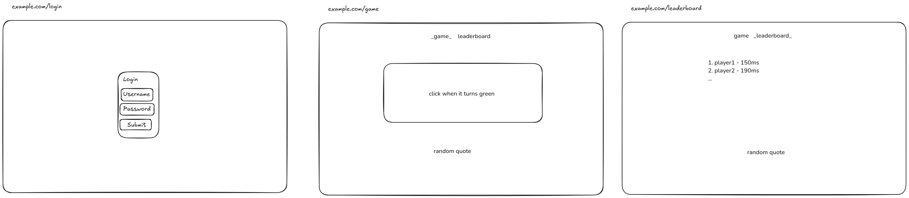

# Your startup name here

[My Notes](notes.md)

A game website with leaderboards and realtime updates.

## 🚀 Specification Deliverable

- [x] Proper use of Markdown
- [x] A concise and compelling elevator pitch
- [x] Description of key features
- [x] Description of how you will use each technology
- [x] One or more rough sketches of your application. Images must be embedded in this file using Markdown image references.

### Elevator pitch

A reaction time game with a leaderboard that gives users notifications when players get a new high score.
(Might switch to minesweeper or hashi if I have extra time.)

### Design

### Key features

- Login page, game page, and leaderboard page
- Realtime leaderboard updates
- Anti cheat (server side verification)

### Technologies

I am going to use the required technologies in the following ways.

- **HTML** - Layout of the web pages
- **CSS** - Design of the web pages
- **React** - Naviation between the pages and logic for the game
- **Service**
  - Logic for connecting to the database and verifying scores
  - 3rd party: [Quote API](https://quotes.rest/) for displaying random quotes at the bottom of the page (supports custom quotes)
- **DB/Login** - Storing users and score information for leaderboards to be generated
- **WebSocket** - Real time leaderboard updates

## 🚀 AWS deliverable

For this deliverable I did the following. I checked the box `[x]` and added a description for things I completed.

- [x] **Server deployed and accessible with custom domain name** - [My server link](https://cs260.duhby.dev).

## 🚀 HTML deliverable

For this deliverable I did the following. I checked the box `[x]` and added a description for things I completed.

- [x] **HTML pages** - Implemented 4 pages: home, login, play, and leaderboard.
- [x] **Proper HTML element usage** - I used head, body, header, main, footer, etc elements.
- [x] **Links** - Each page links to all other pages.
- [x] **Text** - Each page has a title and a paragraph.
- [x] **3rd party API placeholder** - Added random quotes in the footer of all pages.
- [x] **Images** - The home page has an image of a stopwatch.
- [x] **Login placeholder** - There is a /login.html page.
- [x] **DB data placeholder** - The leaderboard page will use the database to generate the leaderboard.
- [x] **WebSocket placeholder** - The play page has a notification placeholder, and the leaderboard will also be updated realtime.

## 🚀 CSS deliverable

For this deliverable I did the following. I checked the box `[x]` and added a description for things I completed.

- [ ] **Header, footer, and main content body** - I did not complete this part of the deliverable.
- [ ] **Navigation elements** - I did not complete this part of the deliverable.
- [ ] **Responsive to window resizing** - I did not complete this part of the deliverable.
- [ ] **Application elements** - I did not complete this part of the deliverable.
- [ ] **Application text content** - I did not complete this part of the deliverable.
- [ ] **Application images** - I did not complete this part of the deliverable.

## 🚀 React part 1: Routing deliverable

For this deliverable I did the following. I checked the box `[x]` and added a description for things I completed.

- [ ] **Bundled using Vite** - I did not complete this part of the deliverable.
- [ ] **Components** - I did not complete this part of the deliverable.
- [ ] **Router** - Routing between login and voting components.

## 🚀 React part 2: Reactivity

For this deliverable I did the following. I checked the box `[x]` and added a description for things I completed.

- [ ] **All functionality implemented or mocked out** - I did not complete this part of the deliverable.
- [ ] **Hooks** - I did not complete this part of the deliverable.

## 🚀 Service deliverable

For this deliverable I did the following. I checked the box `[x]` and added a description for things I completed.

- [ ] **Node.js/Express HTTP service** - I did not complete this part of the deliverable.
- [ ] **Static middleware for frontend** - I did not complete this part of the deliverable.
- [ ] **Calls to third party endpoints** - I did not complete this part of the deliverable.
- [ ] **Backend service endpoints** - I did not complete this part of the deliverable.
- [ ] **Frontend calls service endpoints** - I did not complete this part of the deliverable.

## 🚀 DB/Login deliverable

For this deliverable I did the following. I checked the box `[x]` and added a description for things I completed.

- [ ] **User registration** - I did not complete this part of the deliverable.
- [ ] **User login and logout** - I did not complete this part of the deliverable.
- [ ] **Stores data in MongoDB** - I did not complete this part of the deliverable.
- [ ] **Stores credentials in MongoDB** - I did not complete this part of the deliverable.
- [ ] **Restricts functionality based on authentication** - I did not complete this part of the deliverable.

## 🚀 WebSocket deliverable

For this deliverable I did the following. I checked the box `[x]` and added a description for things I completed.

- [ ] **Backend listens for WebSocket connection** - I did not complete this part of the deliverable.
- [ ] **Frontend makes WebSocket connection** - I did not complete this part of the deliverable.
- [ ] **Data sent over WebSocket connection** - I did not complete this part of the deliverable.
- [ ] **WebSocket data displayed** - I did not complete this part of the deliverable.
- [ ] **Application is fully functional** - I did not complete this part of the deliverable.
